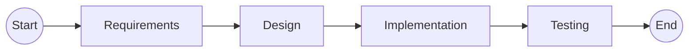

# Introduction

## Software Engineering

Software Engineering is the:

> The production of **maintainable**, **fault-free** software that meets the user’s **requirements** and is delivered **on time** and **within budget**.

**not** just coding.

## Software Development Activities

Software Engineering Activities & their deliverables:

1. **Requirements** specify how the system should function
    - Software Requirements Specification (SRS)
    - Prototype
2. **Design** System Design & review:
    - Software Design Document
    - Interface Design Document
    - Test Cases
    - Data Models
3. **Implementation**
    - Source Code
    - Software
    - Documentation: eg. User Manual
4. **Testing** checking that the software conforms to requirements
    - Test Report eg. User Acceptance test
5. **Maintenance** evolving software to changing customer needs.
    - Feature requests
    - Bug Fixes
