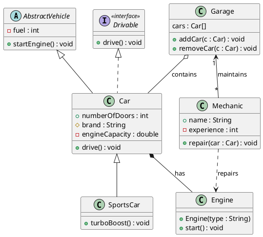
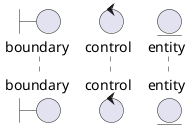
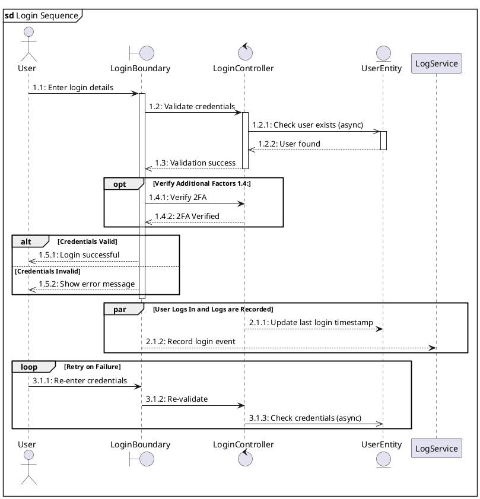
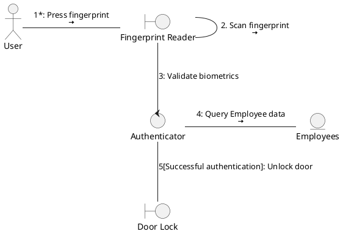

# Requirements Analysis

Designing the software system based on requirements gathered in [analysis](./analysis.md):

## Conceptual Model

Model the structure of the system via UML [Class Diagram](#class-diagram):

- Objects aka Classes
- Attributes aka Properties of objects.
- Operations aka Methods that can be performed on Objects.

## Dynamic Model

Model the implementation of the system via UML Diagrams:

- **Single** [Use Case](./elicitation.md#use-case)

    - [Sequence Diagram](#sequence-diagram): focused on **timing & order of interactions** between objects.
    - [Communication Diagram](#communication-diagram): Interactions between **objects**. Focused on objects.

- **Multiple** Use Cases

    - [State Machine Diagram](#state-machine-diagram):
    - [Activity Diagram](#activity-diagram):

# Class Diagram

- **Abstract Class** class name is in _italics_.
- **Multiplicity** eg. many (\*) `Mechanic`s to 1 (1) `Garage`.
- **Inheritance** subclass `SportsCar` inherits from class `Car`.
- **Implements** implementation `Car` implements `Drivable` interface.
- **Aggregation** `Car` is part of `Garage`, but **can exist independently**.
- **Composition** `Engine` is part of `Car`, but **cannot exist independently**.
- **Dependency** `Mechanic` uses `Engine` **temporarily**, but **does not** have an `Engine` attribute / property.

## Access Modifiers

Access Modifier controls access to Attributes & Operations:

| **Access Modifier** | **Symbol** | **Description**                                             |
| ------------------- | ---------- | ----------------------------------------------------------- |
| Public              | `+`        | Members are accessible from anywhere.                       |
| Private             | `-`        | Members are accessible only within the class.               |
| Protected           | `#`        | Members are accessible within the class and its subclasses. |

## Class Stereotypes

Visualises **timing and order** of interactions between objects:

- **1 Use Case** = 1 Sequence Diagram

Class Stereotypes:

- **Boundary** `<<boundary>>` interface between actor and system.
- **Control** app logic classes.
- **Entity** data model classes.

# Sequence Diagram

Visualises **timing and order** of interactions between objects:

- **1 Use Case** = 1 Sequence Diagram
- **Vertical Bar** on the object's lifeline indicates when the object is **active**.
- **Synchronous** blocking message is **solid arrow ->**
- **Asynchronous** non-blocking message is **thin arrow ->**
- **Return** non-blocking message is **thin dotted arrow `<-`**

Frames used in Sequence Diagram:

- **sd** frame wrapping entire sequence diagram
- **ref** reference another sequence diagram.
- **loop** repeating interactions.
- **alt** Alternative branch: if-else.
- **opt** Optional branch: if.
- **par** interactions run in parallel.

# Communication Diagram

Messages are performed in the **order** of sequence no.:

- `*` **Iteration** indicates that the message may be performed **repeatedly**.
- `[CONDITION]` **Guard** only executes message if `CONDITION` is true.
