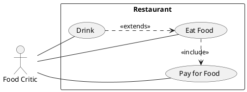

# Requirements Elicitation

Correct requirements ellication is a the **foundation** of a successful [Software Engineering](../index.md) project
as it identifies the **purpose** of the software system.

# Requirements Elicitation Process

1. **Identify Stakeholders**
    - Customers
    - Management
    - Developers
2. **Elicit Requirements**
    - from _problem domain_
    - from _customer day to day_ activities.
3. **Validate Requirements** with stakeholders.
    - Customers: check that the requirements are **what they want**.
    - Development team: check that they understand what the requirements entail.

# Software Requirements Specification (SRS)

Software Requirements Specification (SRS) typically contains:

1. Product Description

    - Purpose of the System: [Mission Statement](#project-mission-statement)
    - Scope of the System
    - Users and Stakeholders
    - Assumptions and Constraints

2. Functional Requirements:

    - [Use Case Model](#use-case-model)
    - [Class Diagram](./analysis.md#class-diagram)
    - [Sequence Diagram](./analysis.md#sequence-diagram)
    - [Communication Diagram](./analysis.md#communication-diagram)
    - Activity Diagram

3. Non-Functional Requirements

    - Availability
    - Security
    - Maintainability
    - Portability

4. Interface Requirements

    - User: [UI Prototype](#ui-prototype)
    - Hardware: hardware ports
    - Software: API compatibility

5. [Data Dictionary](#data-dictionary)

## Project Mission Statement

Project Mission Statement defines the project in _2-3 sentences_:

- **Problem** scope of the project.
- **Stakeholders** Developers, Customers, Management.
- **Outcomes** benefits of the project.

## Types of Requirements

- **Functional** what _features_ must the system have?
    eg. must be interoperate with another system.
- **Non-functional** what _properties_ must the system have? eg. Usability, Reliablility, Performance, Extensibility, Maintainability

## Good Requirements

Good Requirements are:

- **Atomic** specify **only 1** requirement per requirement statement.
- **Verifiable** clear **testable** goalpost to satisfy requirement.
- **Unambiguious** interpretation of the requirement is not up to debate.
    - use words `Shall`, `Must`, `Must Not`, `Is required to`, `Are applicable`, `Responsible for`, `Will`.
- **Tracable** requirements can be cited by their requirement IDs back to the documents from which they where defined.

Example:

> REQ-002: The system **shall** require users to enter a valid email address during account registration.

## UI Prototype

**UI Prototype** mock up to work out User Experience (UX) of the User Interface (UI)

## Data Dictionary

**Data Dictionary** is a problem domain glossary that **unambiguiously** define terms so that they are not open for interpretation.

# Unified Modelling Language (UML)

Set of Diagrams for designing Software, **not** a programming language.

- [Class Diagram](./analysis.md#class-diagram)
- [Activity Diagram](./analysis.md#activity-diagram)
- [Use Case Diagram](#use-case-diagram)
- [State Machine Diagram](./analysis.md#state-machine-diagram)
- [Communication Diagram](./analysis.md#communication-diagram)

# Use Case Model

Use Case Model combines:

- Use Case Diagram
- Use Case Description

## Use Case

Use Case:

- describes how a user **uses a system** to accomplish a particular **goal**.
- summary of ≥1 functional requirements **utilised together** by an **actor**.

## Use Case Diagram

### Use Case Diagram Associations

- `<<include>>` large use case includes functionality from smaller use case (arrow side).
- `<<extends>>` use case **optionally** extends functionality of another use case (arrow side).

## Use Case Description

Use Case Description contains:

- **Participating Actors**
    - 1 **initiating actor** triggers the use case.
- **Entry Conditions** start state before the use case begins as a set of conditions.
- **Exit Conditions** end state after the use case ends as a set of conditions.
- **Flow of Events** steps performed in the **successful**/happy path:
    - Actor steps "The Actor ..."
    - System steps "The System ..."
- **Alternative Flows** steps performed on deviations from the successful path.
    - ID format: `AF-[0-9]+` **variations** from successful path.
    - ID format: `EX-[0-9]+` **exceptions** (errors) from successful path.
