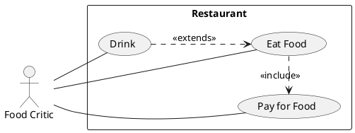

# Requirements Elicitation II

## Unified Modelling Language (UML)

Set of Diagrams for designing Software, **not** a programming language.

- Class Diagram
- Activity Diagram
- Use Case Diagram
- State Machine Diagram
- Communication Diagram

## Use Case

Use Case:

- describes how a user **uses a system** to accomplish a particular **goal**.
- summary of &ge;1 functional requirements **utilised together** by an **actor**.

## Use Case Model

Use Case Model combines:

- Use Case Diagram
- Use Case Description

## Use Case Diagram

### Use Case Diagram Associations

- `<<include>>` large use case includes functionality from smaller use case (arrow side).
- `<<extends>>` use case **optionally** extends functionality of another use case (arrow side).
