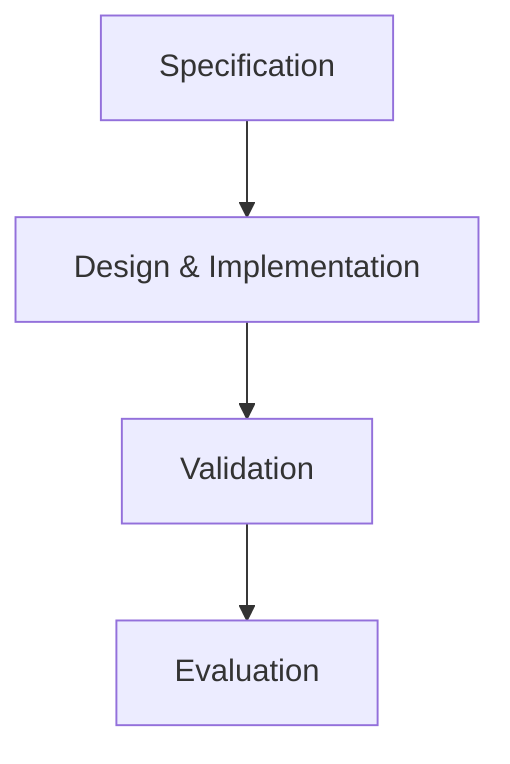
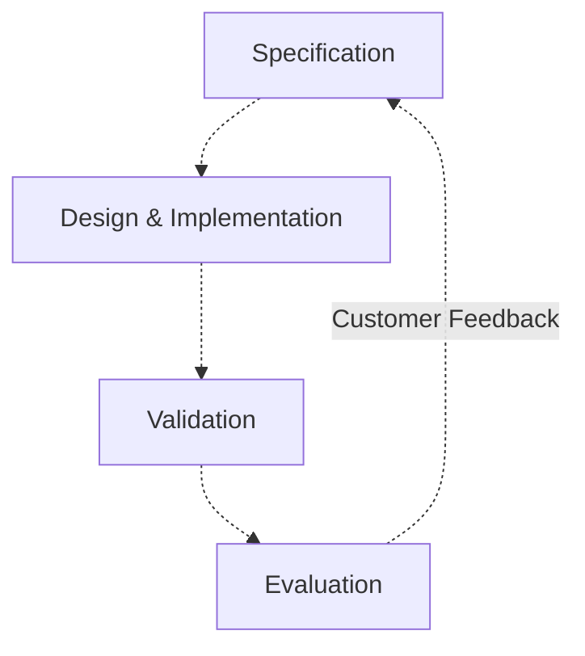
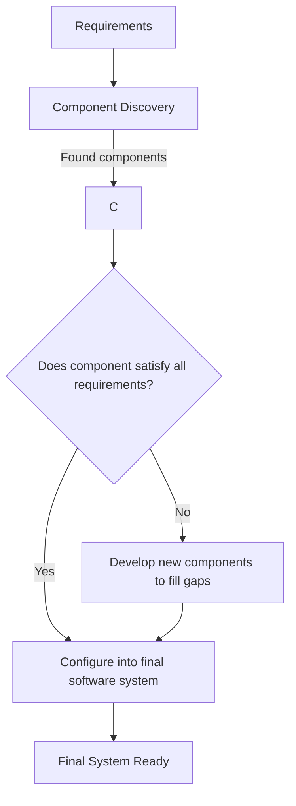

# Software Processes

Software Development LifeCycle (SDLC) Activities performed in [Software Engineering](./index.md) **common** to all software processes:

1. **Specification** [Requirements Ellicitation](./requirements/elicitation.md), [Requirements Analysis](./requirements/analysis.md)
2. **Design & Implementation** System design & implementation
3. **Validation** Testing
4. **Evaluation** Maintenance

# Comparing Software Processes

Software Processes can be compared by their characteristics:

- Plan Driven
- Agile
- Incremental: build software in **small steps**

> **Agile ≠ Incremental** eg. Development in rigid stages with small step
> iterations within each stage is **incremental but not agile**.

## Plan Driven

**Plan Driven** aka Waterfall **never returns** to previous SDLC Activity.

## Agile

**Agile** performs SDLC Activities **repeatedly** in iterative **sprint cycles**

# Software Process Models

| Model                             | Plan Driven | Agile | Incremental |
| --------------------------------- | ----------- | ----- | ----------- |
| **Waterfall**                     | Yes         | No    | No          |
| **Incremental (Masterplan)**      | Yes         | No    | Yes         |
| **Incremental (Agile)**           | No          | Yes   | Yes         |
| **Integration and Configuration** | Yes         | No    | Yes         |

## Waterfall

Waterfall performs SDLC Activities in a series of **rigid stages**:

- **Pros** :thumbsup:
    - **Progress** clearily identifiable project progress.
    - **Documentation** up to date documentation.
    - **Large Systems**: suitable for building large systems with multiple components.
- **Cons** :thumbsdown:
    - **No Return** once a stage is completed.

## Incremental

Incremental **interweaves** SDLC activities:

- **Pros** :thumbsup:
    - **Flexible** to changing requirements.
    - **Rapid Delivery** of incremental versions.
    - **Custom Feedback** can be obtained for each incremental version.
- **Cons** :thumbsdown:
    - **Unclear Progress** No clearly defined project end.
    - **Poor System Design** Resulting from accommodating changing requirements over time.
        - Initial system design might **not be optimal** for **new requirements**.
        - Refactoring required to correct system design issues.

## Integration & Configuration

Integration of **externally sourced reusable components** by **configuring** them to work together as a single software system:

- **Pros** :thumbsup:
    - **Lower Development Cost** since we can reuse instead of paying developers to write our own.
    - **Faster Delivery** since we don't have to spend time to write our own.
- **Cons** :thumbsdown:
    - **Gaps in Requirements** components may not satisfy all requirements.
    - **Lack of Control** over reused components project direction.
    - **Limited Support** for reused components.

### Reuse Oriented-Software Development

**Integration & Configuration** Software Process that prioritises the **reuse** of off-the-shelf components
where possible:

