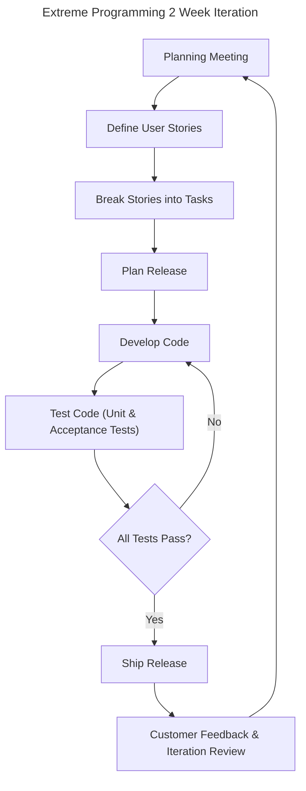

# Agile

[Incremental](./introduction.md#incremental) [Iterative](./introduction.md#agile) [Software Process](./introduction.md) for **rapid** software development:

- **Rapid** software has to **quickly** adapt rapidly changing requirements via frequent new version releases.
- **Code over Docs** Focus on writing code over creating extensive documentation.
    - Reduces overhead of keeping documentation in **sync** with **changing requirements**
- **Usage**
    - **Good** for **small-medium** projects, **experienced** developers.
    - **Bad** for **large projects**, inexperienced developers.

## Agile Manifesto

| Preferred               | Less Important            |
| ----------------------- | ------------------------- |
| Individuals & Interests | Processes & tools         |
| Working Software        | Comphensive Documentation |
| Customer Collaboration  | Customer Negotiation      |
| Responding to Change    | Following a Plan          |

## Agile Principles

- **Customer Involvement** throughout the development process to confirm requirements & give feedback.
- **Incremental Delivery** of software via releasing incremental versions.
- **People Not Process** development team should be allowed to follow their **own workflow** rather than a strict process.
- **Embrance Change** system design should be **extensive** since we expect changing requirements.
- **Maintain Simplicity** reduce complexity where possible.

# Extreme Programming (XP)

[Agile](#agile) development method:

- **Continuous Integration** New software build & **tested** several times per day.
- **Rapid Release** 1 version released per 2 weeks.

## User Stories

> **Format** As a ROLE,
> I want to perform ACTION,
> So that I gain BENEFIT.

Software Requirements as User Stories:

- **Epics** users stories are broken down from Epics (large feature).
- **Card** size limit constraints the **scope** of each User Story.
- **Conversation** include **background information** necessary to understand the User Story.
- **Confirmation** include both functional & non-functional **Acceptance Criteria**

### Acceptance Criteria

Defines when the User Story is "done":

- **Intent not Solution** criteria should define "what" that needs to be, not the "how".
- **Implementation Independent** Developers should decide how to implement.
- **High Level** Includes only detail **necessary** to define requirements.

### Release Planning

The Customer chooses which User Story to add to the next release.

### User Story Tasks

User Stories are further decomposed by development team into implementation tasks:

- **Story Point** no. that gives a **workload** estimate for each task.

## Refactoring

Making **code improvements** to "tidy" up the code even when not required:

- **Maintainability** code changes are easy to make due to estensible structure.
- **Understandablty** makes the code **understandable**, reducing need for documentation.

> eg. Reorganise classes, tidying up methods, extracting common code into functions etc

## Test Driven Development (TDD)

TDD: write tests **before** code:

- **Clarifies Requirements** writing **Tests as Code** removes any **ambiguity** from requirements. Testing can then be performed by executing test code.
- **Automated** test harness facilitates automatic testing of software. Needed since
    we are testing frequently in Continuous Integration.
- **User Acceptance Test** customer can develop acceptance tests for requirements in User Stories.

## Pair Programming

2 developers code together, **alternating** between roles:

- **Roles**:
    - **Developer** writes the code.
    - **Reviewer** checks the code for mistakes.
- **Knowledge Sharing** about the codebase will happen when the developers work together.
    Reduces the risk of employees leaving and now no one knows how the code works.
