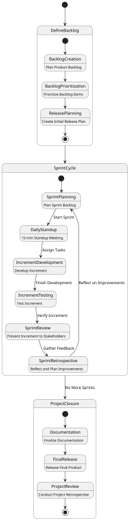

# Project Management

Manage [Software Engineering](../index.md) project to ensure **software delivery** happens **on time** & **on budget**.

# Scrum



Project Management method for [Iterative Software Processes](./introduction.md#agile) (eg. Agile, XP) with phases:

1. **Initial Phase** Requirements, Design System Architecture.
2. **Sprint Cycle** Develop & release a **incremental software version** in **2-4 weeks**.
3. **Project Closure** Complete documentation, Retrospective.

## Scrum Terminology

| Term                                        | Definition                                                                                                                                                                                   |
| ------------------------------------------- | -------------------------------------------------------------------------------------------------------------------------------------------------------------------------------------------- |
| **Development team**                        | A self-organizing group of up to 7 developers responsible for building software and essential project documents.                                                                             |
| **Potentially shippable product increment** | A software increment delivered from a sprint, ideally in a finished **tested** state requiring no further work for final integration.                                                        |
| **Product backlog**                         | A **prioritized single source** of tasks, features, requirements, or supplementary items for the Scrum team to address, expressed as [User Stories](./agile.md#user-stories).                |
| **Sprint backlog** (Sprint Goal)            | A **fixed** (unchanged for entire sprint) set of Product Backlog Items (PBIs) selected to worked on the sprint cycle. **Unfinished** items are returned to the product backlog.              |
| **Product owner**                           | A stakeholder responsible for defining and prioritizing features, owns / manages the Product Backlog, **maximising value of product** delivered.                                             |
| **Scrum**                                   | A daily **short 15 minute** team meeting to review progress and plan work for the day. **In depth discussion** should be done **outside** of Scrum.                                          |
| **Scrum Master**                            | Ensures the Scrum process is followed, shields the team from distractions by **point of contact** for rest of organisation, removes **blockers** from progress.                              |
| **Sprint**                                  | A **2-4 week** development iteration focused on delivering specific goals.                                                                                                                   |
| **Sprint Review**                           | A **1 hr × no. Sprint weeks** meeting at the end of a sprint between **Product Owner & External Stakeholders** on the state of the project to generate potential changes to product backlog. |
| **Sprint Retrospective**                    | A **45 min × no. Sprint weeks** meeting at the end of a sprint where the **Internal Stakeholders** reflect on what went well, what didn’t, and how to improve next time.                     |

## Velocity

Velocity $`V`$ is the **average** workload as [User Story](./agile.md#user-stories) Points $`p_i`$ a development over $`n`$ no. of Sprints:

```math
V = \frac{\sum^{n}_{i} p_i}{n}
```

## Product Backlog

Good Product Backlogs should be:

- **Detailed** not ambiguous.
- **Emergent** up to date with latest requirements.
- **Estimated** product backlog items have workload estimates as story points.
- **Prioritised** items ranked by priority.
