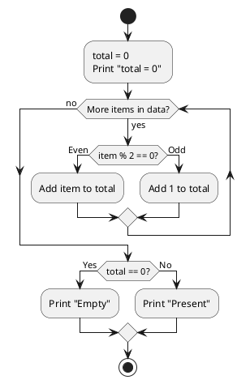
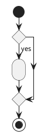
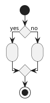
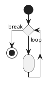
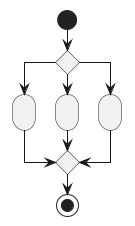
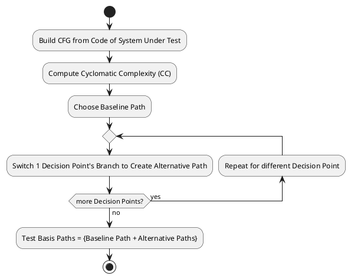

# Control Flow Testing

**White Box** Testing method that focuses on testing **code paths** identified
by its Control Flow Graph (CFG) by choosing inputs that exercise different code paths.

## Control Flow Graph (CFG)

```python
def process_data(data):
    total = 0
    print("total = 0")
    for item in data:
        if item % 2 == 0:
            total += item
        else:
            total += 1
    if total == 0:
        print("Empty")
    else:
        print("Present")
    return total
```

**Directed Acyclic Graph** that represents the Python code:



- **Process Block** contains a group of sequential statements.
- **Decision Point** represented by diamond. Can be **binary (2-case)** or **n-nary (n-case)**.

### Common Programming Constructs CFG

**If** statement:



**If/Else** Statement:



**While/For** Loop:



**Switch** Statement:



## Test Coverage

Test Coverage Levels:

| Level       | Coverage                     | Description                                   |
| ----------- | ---------------------------- | --------------------------------------------- |
| **Level 1** | 100% **statement** coverage  | Every **line of code** is tested              |
| **Level 2** | 100% **branch** coverage     | Every **decision point branch** is taken      |
| **Level 3** | 100% **basis path** coverage | Every **linearly independent path** is tested |
| **Level 4** | 100% **path** coverage       | Every **path** is tested                      |

## Total No. of Paths

Total No. of Paths $`P`$ tested in **Level 4**: 100% **path** coverage testing:

- $`D`$ is no. of **binary decision points**.
- $`L`$ is no. of **loop iterations**

```math
P = 2^D \times L
```

# Basis Path Testing



[Control Flow Testing](#control-flow-testing) that focuses on **Level 3** [Test Coverage](#test-coverage):
Testing all **basis paths** aka linearly independent paths in the [Control Flow Graph (CFG)](#control-flow-graph-cfg).

> **Non Unique** Set of basis paths is **not unique**, depends on initial baseline path chosen.

1. Build CFG from code of System Under Test.

2. Compute Cyclometric Complexity (CC) to determine no. of **basis paths** to test.

    > Not all basis paths identified by CC are **feasible** (reachable) in code.
    > Such basis paths are **impossible** to test.

3. Choose a **baseline path** consisting of **false branches** choices for each decision point.

4. Switch **branch** of 1 decision point to create an **alternative path**.

5. Repeat step 4 for all other decision points to obtain **basis paths (Baseline + Alternative Paths)**.

6. Craft **test inputs** to test all identified basis paths.

> **Loops** Considerations when dealing with loops:

> - **No Iteration** skip the loop cycle entirely.
> - **1 Iteration** perform 1 iteration of loop cycle and then exit the loop cycle.

## Cyclometric Complexity (CC)

CC computes the total no. of **basis paths** in a CFG:

- Method A: Edges $`E`$, Vertices $`V`$ in CFG:

```math
\text{CC} = |E| + |V| + 2
```

- Method B: $`D`$ No. of **binary decision points** in CFG:

```math
\text{CC} = D + 1
```
