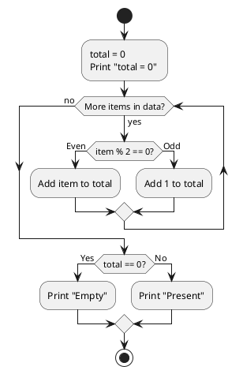
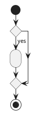
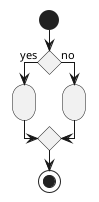
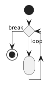
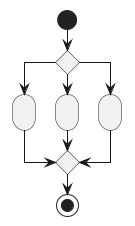
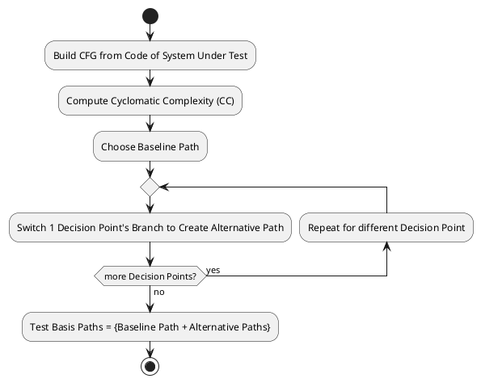

# Software Bug

> A software bug is an **error, flaw, failure or fault** in a computer program or system that causes it to produce an **incorrect or unexpected result**, or to behave in **unintended ways**.

Bugs are **unexpected** behaviour in a Software System that **deviates** from requirements:

- **Debugging** identifying the **root cause** of the bug.

# Software Testing

Testing: checking software system for **known bugs**:

- **User Acceptance** reduce risk of failing User Acceptance Test done by Customer.

> Software Testing can be used to show the **presence of bugs** but **never** to
> show their **absence**.

## Black Box & White Box Testing

Types of Software Testing:

- **Black Box** testing done **without** knowledge of code implementation (requirements only).
  - [Equivalence Class Testing](#equivalence-class-testing)
  - [Boundary Value Testing](#boundary-value-testing)
- **White Box** testing done **with** knowledge of code implementation (code + requirements).
  - [Control Flow Testing](#control-flow-testing)

| Testing       | Test Complexity | Test Thoroughness | Test Coverage |
| ------------- | --------------- | ----------------- | ------------- |
| **Black Box** | Lower           | Lower             | No            |
| **White Box** | Higher          | Higher            | Yes           |

## Unit, Integration, System, Acceptance Testing

- **Unit Test** Test a single **unit** of software (eg. function) in **isolation**.
- **Integration Test** Test **interoperability** of **multiple components**
- **System Test** Test functionality of system **as a whole**.
- **Acceptance Test** Testing done by customer to verify **quality** of software delivered.

## Test Case

Components of a Test Case are derived from **verifiable** [Requirements](../requirements/analysis.md)

| Component  | Description               |
| ---------- | ------------------------- |
| **Name**   | Name of the test case     |
| **Path**   | Location of the test case |
| **Input**  | Test input                |
| **Oracle** | **Expected** test output  |
| **Log**    | **Actual** test output    |

## Order of Testing

Order of running Test Cases:

- **Cascading** test cases must be run **in order** as they **depend** on prior test cases.
- **Independent** test cases can be run in **any order**.

| Order of Testing | Test Complexity | Parallel Execution |
| ---------------- | --------------- | ------------------ |
| **Cascading**    | Lower           | No                 |
| **Independent**  | Higher          | Yes                |

# Equivalence Class Testing

**Black Box** testing method that partition possible **input domain** by **expected output** [equivalence classes](#equivalence-classes).

Test &ge; 1 set of inputs for **each equivalence class**:

- **Assumption** If the code works for the set of input(s), it should work for
  **all other inputs** in the same equivalence class.

## Equivalence Classes

Equivalence Classes are sets of possible inputs with same **expected output**:

- **Valid (Testing by Contract)** Test successful / happy path for **valid** inputs eg. Login successful.
  - **Multiple Valid Values** test multiple valid input values for each test case.
  - **Exhaustive** Optionally, if the valid input domain is small **all valid inputs** can be tested.
- **Invalid (Defensive Testing)** Test unsuccessful path for **invalid** inputs eg. Bad login credentials.
  - **Single Invalid Value** test only 1 single input value (rest are valid inputs) for each test case
    to check code correctly rejects even with only 1 invalid input.
- **Exception** error case. eg. Unable to connect to Database.

> **Numeric Equivalence Classes are Contiguous**  
> Q: Suppose you have **Invalid** output for input range $`-5 \le x \le -2`$ and
> $`3 \le x \le 10`$.  
> What are the Equivalence Classes?
>
> A: 2 Equivalence classes since the input ranges are **non overlapping**:
>
> - **Invalid** $`-5 \le x \le -2`$
> - **Invalid** $`3 \le x \le 10`$
>
> Does **not** apply to **discrete** test inputs since they have no notion of "ranges".

# Boundary Value Testing

**Black Box** Testing **Heuristic** to select test input values for **numeric** input range $`x \in [a,b]`$:
test **around** boundary values $`a`$ & $`b`$:

- **Just Above** $`x + \epsilon > a, \epsilon > 0`$
- **At Boundary** $`x = a`$
- **Just Below** $`x - \epsilon < a, \epsilon > 0`$

> **Remove Duplicates** Suppose selected test inputs overlaps with the test
> inputs of another case. Remove the duplication, since it redundant to verify
> twice with exactly the inputs.

# Control Flow Testing

**White Box** Testing method that focuses on testing **code paths** identified
by its Control Flow Graph (CFG) by choosing inputs that exercise different code paths.

## Control Flow Graph (CFG)

```python
def process_data(data):
    total = 0
    print("total = 0")
    for item in data:
        if item % 2 == 0:
            total += item
        else:
            total += 1
    if total == 0:
        print("Empty")
    else:
        print("Present")
    return total
```

**Directed Acyclic Graph** that represents the Python code:



- **Process Block** contains a group of sequential statements.
- **Decision Point** represented by diamond. Can be **binary (2-case)** or **n-nary (n-case)**.

### Common Programming Constructs CFG

**If** statement:



**If/Else** Statement:



**While/For** Loop:



**Switch** Statement:



## Test Coverage

Test Coverage Levels:

| Level       | Coverage                     | Description                                   |
| ----------- | ---------------------------- | --------------------------------------------- |
| **Level 1** | 100% **statement** coverage  | Every **line of code** is tested              |
| **Level 2** | 100% **branch** coverage     | Every **decision point branch** is taken      |
| **Level 3** | 100% **basis path** coverage | Every **linearly independent path** is tested |
| **Level 4** | 100% **path** coverage       | Every **path** is tested                      |

## Total No. of Paths

Total No. of Paths $`P`$ tested in **Level 4**: 100% **path** coverage testing:

- $`D`$ is no. of **binary decision points**.
- $`L`$ is no. of **loop iterations**

```math
P = 2^D \times L
```

# Basis Path Testing



[Control Flow Testing](#control-flow-testing) that focuses on **Level 3** [Test Coverage](#test-coverage):
Testing all **basis paths** aka linearly independent paths in the [Control Flow Graph (CFG)](#control-flow-graph-cfg).

> **Non Unique** Set of basis paths is **not unique**, depends on initial baseline path chosen.

1. Build CFG from code of System Under Test.
2. Compute Cyclometric Complexity (CC) to determine no. of **basis paths** to test.

   > Not all basis paths identified by CC are **feasible** (reachable) in code.
   > Such basis paths are **impossible** to test.

3. Choose a **baseline path** consisting of **false branches** choices for each decision point.
4. Switch **branch** of 1 decision point to create an **alternative path**.
5. Repeat step 4 for all other decision points to obtain **basis paths (Baseline + Alternative Paths)**.
6. Craft **test inputs** to test all identified basis paths.

> **Loops** Considerations when dealing with loops:

> - **No Iteration** skip the loop cycle entirely.
> - **1 Iteration** perform 1 iteration of loop cycle and then exit the loop cycle.

## Cyclometric Complexity (CC)

CC computes the total no. of **basis paths** in a CFG:

- Method A: Edges $`E`$, Vertices $`V`$ in CFG:

```math
\text{CC} = |E| + |V| + 2
```

- Method A: $`D`$ No. of **binary decision points** in CFG:

```math
\text{CC} = D + 1
```
