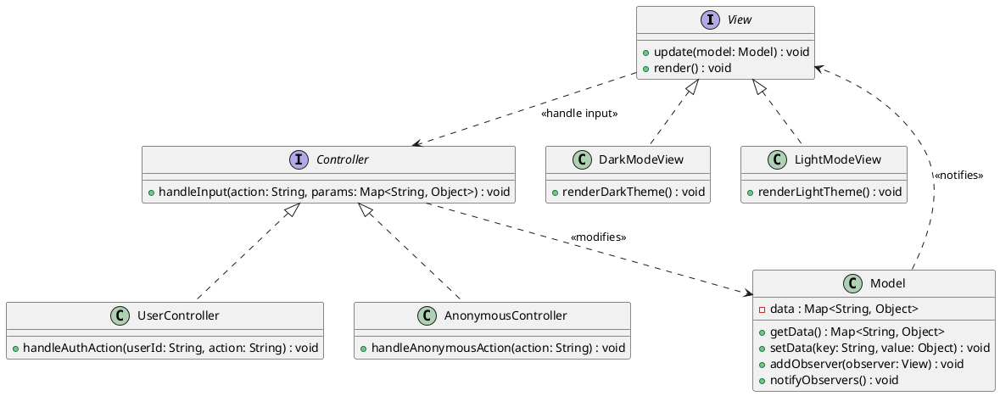

# Model View Controller (MVC)

[Software Architecture Style](./software-architecture.md#software-architecture-style) for user facing **interactive** systems
that **separates**:

- **Data (Model)** data structure & logic to manipulate data.
- **Presentation (View & Controller)**
    - **View** presents data to the user.
    - **Controller** handles user actions.

> **MVC ≠ Boundary-Control-Entity**

> - Model = Control + Entity
> - View + Controller = Boundary

> **Not [Layered Architecture](./software-architecture.md#layered-architecture)**
> Cyclic Dependency between Model, View, Controller makes it **impossible** to
> separate into **clear layers** required in layered architecture.

## MVC Design Patterns

[Design Patterns](./object-design.md#design-patterns) used in MVC:

- [Strategy Pattern](./object-design.md#strategy-pattern)
    - **View** eg. Light Mode & Dark Mode presentation strategies.
    - **Controller** eg. Anonymous vs logged-in User functionality.
- [Observer Pattern](./object-design.md#observer-pattern)
    - **View** observes changes on the **Model**, which then notifies View to reflect changes.

## MVC Tradeoffs

**Pros**

- **Loose Coupling** via indirection (ie. View makes changes to Model via Controller).
- **Simultaneous Development** of Model, View, Controller independently.
- **High Cohesion** related components are grouped together (eg. all Models are grouped).

**Cons**

- **Incompability** Model, View, Controller no longer interoperate together.
- **Complexity** due to additional indirection.
