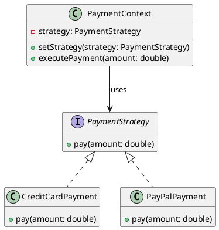
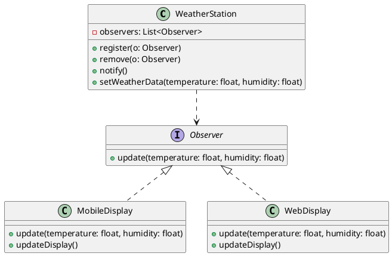
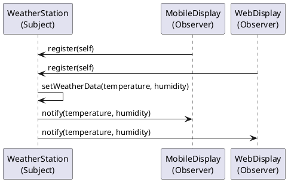

# Object Design

Object design: how to design Objects / Classes in [Class Diagram](../requirements/analysis.md#class-diagram)?

- **Interface Specification** defining **boundaries** between components eg. operations, arguments, properties.
- **Identifying Reuse** leveraging **existing** libraries & [Design Patterns](#design-patterns).
- **Restructuring** refactoring done to preserve code maintainability.
- **Optimisation** improve speed or memory performance.

# Design Patterns

Existing **solution** to a **design problem**:

- **Name** terminology used to talk about the design pattern.
- **Problem** that design pattern attempts to resolve.
- **Solution** how to implement the design pattern.
- **Consequences** trade offs in implementing the design pattern.

## Types of Design Patterns

Design Patterns classified by the problem they solve:

- **Creation Patterns**: how to **create** objects?
- **Structural Patterns**: how to **compose** (combine) objects?
- **Behavioural Patterns**: how to **implement** specific **behaviour** with objects?

# Strategy Pattern

Strategy is **Behavioural Pattern**:

- **Problem** a set of algorithms (eg. `CreditCardPayment`, `PayPalPayment`) should be **interchangeable** (eg. `PaymentStrategy`)
- **Solution** implement algorithms behind a **common interface**.
- **Consequences**
    - **Pros**:
        - **Encapsulation** hides implementation details.
        - **Extensiblity** ie. code dependent on `PaymentStrategy` does **not need to change**
            to add a new `PaymentStrategy` implementation.
        - **Hot Swappable** Software behaviour change at runtime by swapping classes (eg. `CreditCardPayment` -> `PayPalPayment`).
    - **Cons**: Increases complexity.

# Observer Pattern

Strategy is **Behavioural Pattern**:

- **Problem** Broadcast: Update **≥1** observer objects when a subject object **changes** without polling.
- **Solution**
    1. Observers (eg. `MobileDisplay`, `WebDisplay`) `register()` themselves with the Subject (`WeatherStation`)
    2. Subject calls `notify()` on Observers to notify them of changes.
    3. Observer obtains changes from Subject and does what it needs to do.
- **Pros**
    - **Loose Coupling** subject is **not dependent** on Observer implementations. Observer does not have to **poll** Subject constantly for changes.
- **Cons**
    - **Performance** overhead.
    - **Complexity** increases code complexity.

## Change Propagation

How changes are propagated from Subject to Observer:

- **Pull Approach** changes "pulled" by observer via calling methods on the Subject (call back).
    - **2-Way** communication (Subject -> Observer, Observer -> Subject) **increased** coupling.
    - **Selective Changes** each Observer can retrieve only the changes it needs by selective calling subject.
- **Push Approach** changes "pushed" by subject via `notify(changes)` parameter.
    - **1-Way** communication (Subject -> Observer) **reduced** coupling.
    - **All Changes** same set of changes are pushed to all observers.
- **Push + Pull** combines both approaches by having subject **push** minimal changes
    and the observer **pull** any additional changes that it requires.
