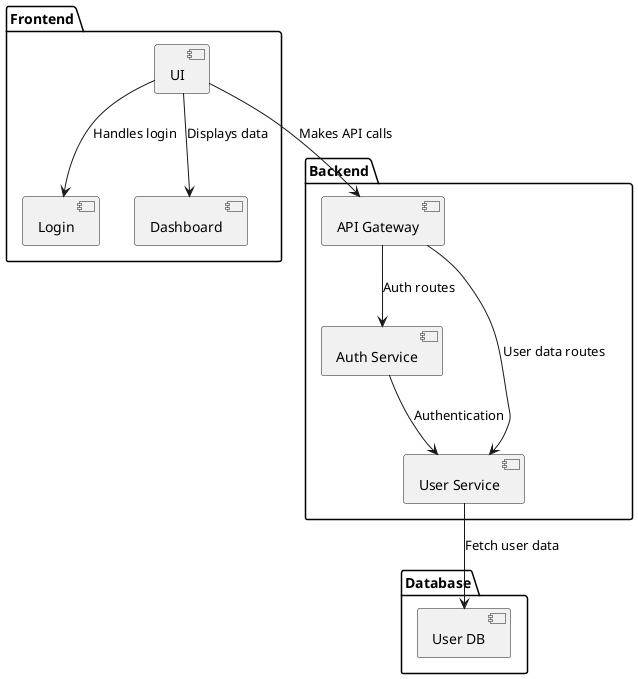
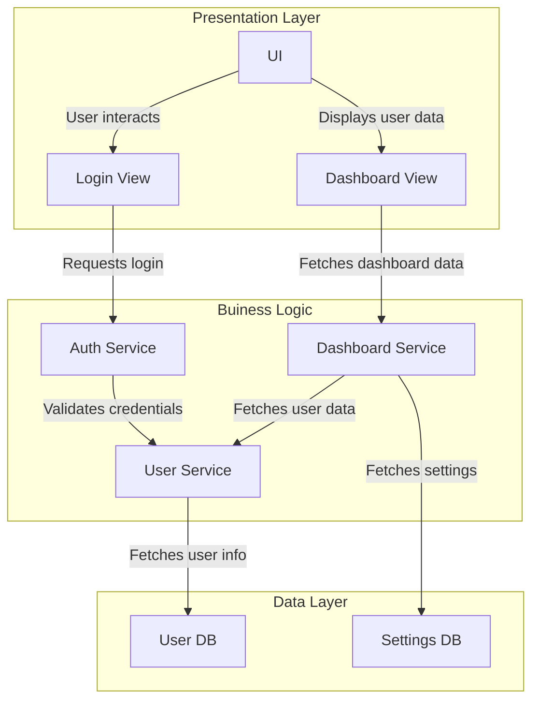

# Software Architecture

**High Level** overview of how system **components** & **interactions** between them:

- **Components** units of software system eg. frontend, backend
- **Interactions** communication between components eg. API call.

## Software Architecture Motivation

Software Architecture / System Design is needed for:

- **Non Functional Requirements** must be **implemented** in System Design.
- **Larger Software** Lowering **complexity** in larger software systems by organising components.
- **Costs & Schedule** Correcting **bad System Design** gets progressively **more costly** as development progresses and might **delay** timely software release.

# Software Architecture Diagram

- **Hierarchical** child components (eg. `UI`) are **nested** with parent components (eg. `Frontend`)
- **Abstract** obmits **unnecessary** details.
- **Purposeful** focused on **structure & interactions** of components.

# Software Architecture Style

**Pattern** (well known solution) of organising components in Software Architecture Designk

# Layered Architecture

Software Architecture Style that groups components into **layers**

- **Upper -> Lower** Upper layers can call lower layers, but **not the other way around**.
- **Pros**
    - **Code Reuse** for components in **lower layers**.
    - **Extensibility** for components in **upper layers**.
- **Cons**
    - **Performance** overhead.
    - **Hard to Design** which layer a component should belong to could be **unclear**.
